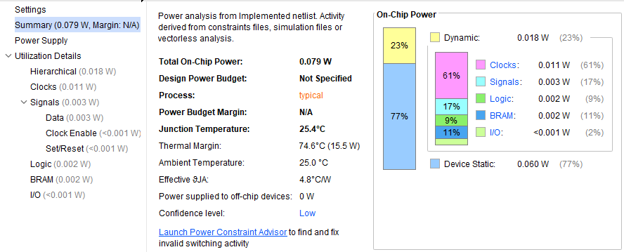
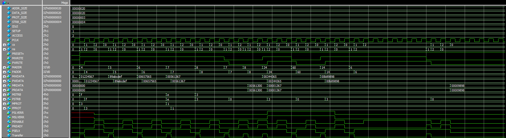
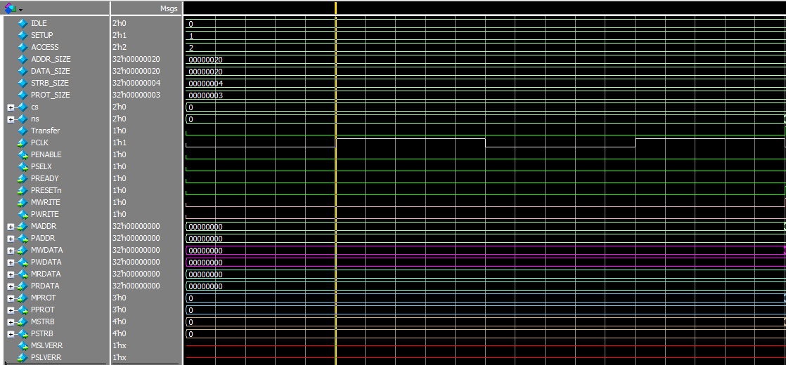
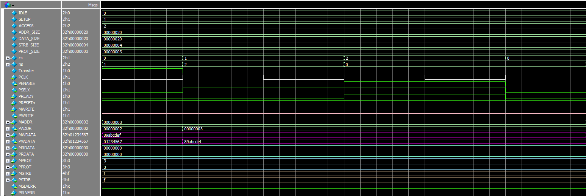
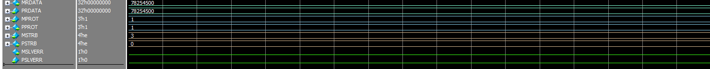
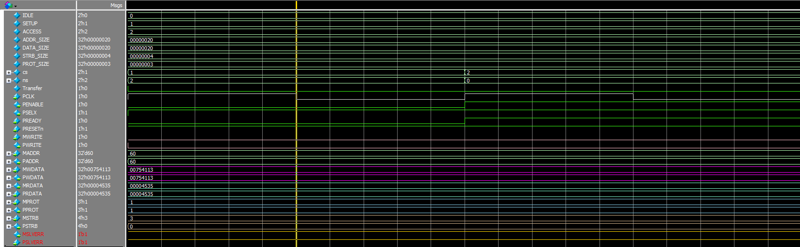

# 🧩 AMBA APB Protocol v2 🚀

## **Advanced Microcontroller Bus Architecture – APB Version 2**

### **👨‍💻 Developed by:** Fares Wael Hegazi  
### **🖥️ Language:** Verilog HDL | **🛠️ Toolchain:** Vivado 2023.1 | **🔌 Target FPGA:** Basys3 (Xilinx Artix-7)

> ⚡ A lightweight and low-power peripheral interface for efficient CPU communication via AHB–APB bridge.

---

## 📖 Project Overview

The **AMBA APB Protocol v2** provides a **lightweight** and **low-power interface** to connect peripherals such as **UART, GPIO, Timers, and more** with a CPU through the **AHB–APB bridge**.  

This implementation focuses on:  
- 🛠️ **Modular Verilog design** – easy to extend and maintain  
- 🧪 **Testbench verification** – ensures correct functionality  
- 💡 **FPGA synthesis** – ready for deployment on Basys3 (Xilinx Artix-7)

---

## ⚙️ Project Specifications

| 🔹 Parameter          | 🔹 Value                                  |
|-----------------------|------------------------------------------|
| **FPGA Board**        | Basys3 (Xilinx Artix-7 XC7A35T)          |
| **Clock Frequency**   | 50 MHz                                   |
| **Data Bus Width**    | 32 bits                                  |
| **Address Bus Width** | 32 bits                                  |
| **Simulation Tool**   | Vivado Simulator                          |
| **Target Device**     | Embedded peripherals simulation          |
| **Protocol Version**  | AMBA APB v2                              |
| **Reset Type**        | Active Low                               |

---

## 🏗️ System Architecture

### 🔹 Architecture Flow
**CPU → AHB Bus → APB Bus → Peripherals**  
*(UART, GPIO, Timer…)*

### 💡 How it Works
Instead of having the CPU directly handle every peripheral, the **APB bus** manages these communications to:  
- ⚡ **Reduce CPU load**  
- 🔋 **Lower power consumption**  
- 📤 **Maintain efficient data transfer**  

This modular approach ensures peripherals communicate reliably without overwhelming the CPU.

---

## 🧩 Implemented Modules

| 📁 Module File                  | ⚙️ Functionality                                             |
|---------------------------------|-------------------------------------------------------------|
| **AMBA_APB_PROTOCOL_BUS.v**     | Implements the bus protocol logic, state transitions, and control signals |
| **AMBA_APB_SLAVE.v**            | Simulates peripheral behavior, data memory, and response generation |
| **AMBA_APB_TOP.v**              | Integrates master and slave modules into a single connected system |
| **AMBA_APB_TB.v**               | Testbench used for functional verification and waveform generation |

---

## ⚡ Main Signals

| 🔹 Signal  | 🔹 Direction | 🔹 Width | 🔹 Description                     |
|------------|-------------|----------|-----------------------------------|
| **PCLK**    | Input       | 1 bit    | APB clock                         |
| **PRESETn** | Input       | 1 bit    | Active-low reset                  |
| **PSEL**    | Output      | 1 bit    | Slave select signal               |
| **PENABLE** | Output      | 1 bit    | Indicates access phase            |
| **PWRITE**  | Output      | 1 bit    | 1 = Write, 0 = Read               |
| **PADDR**   | Output      | 32 bits  | Address line                       |
| **PWDATA**  | Output      | 32 bits  | Write data line                     |
| **PRDATA**  | Input       | 32 bits  | Read data line                      |
| **PREADY**  | Input       | 1 bit    | Slave ready signal                  |
| **PSLVERR** | Input       | 1 bit    | Slave error indicator               |

---

## 🗂️ Block Diagram

### Visual Diagram
  

## 🛠️ Design Flow

### 1️⃣ Elaboration
**Description:** Checks design hierarchy and module connectivity.  
  

### 2️⃣ Synthesis
**Description:** Converts RTL into a gate-level representation, showing logic utilization and timing.  

### 3️⃣ Implementation
**Description:** Performs placement, routing, and timing optimization for FPGA deployment.  

---

## 🧪 Simulation Results

### ✍️ Write Transaction
- Master asserts `PWRITE = 1` and `PSEL`  
- Data transferred via `PWDATA`  
- `PREADY` goes high indicating successful write  

### 📥 Read Transaction
- Master sets `PWRITE = 0`  
- Slave drives `PRDATA` with requested data  
- `PREADY` indicates valid read  

### ⚠️ Error Case
- Invalid address or out-of-range access triggers `PSLVERR = 1`  

---

## 📊 Waveform Outputs

### Full Waveforms
- 
- 
-   
-   
- 

---

## 🧰 Tools Used

| 🛠️ Tool             | ⚙️ Purpose                                   |
|---------------------|---------------------------------------------|
| **Vivado 2023.1**    | Design, synthesis, implementation, simulation |
| **GTKWave**          | Waveform analysis                             |
| **Basys3 Board**     | FPGA testing platform                          |
| **Verilog HDL**      | Hardware description language                 |

---

## 👤 Author

**Name:** Fares Wael Mohamed Mahmoud Hegazi  
**Title:** Communication & Electronics Engineering Student – ECE 300  
**Roles:** Digital IC Design | Verilog Developer | Hardware Instructor  
**Contact:** fareswaelhegazy@gmail.com 

---

## 🚀 Future Enhancements

- 🔹 Support for multiple slave devices  
- 🔹 Integration with AHB bridge for full SoC communication  
- 🔹 Parameterized timing control  
- 🔹 Graphical transaction visualizer  

---

# إِنَّ اللَّهَ وَمَلَائِكَتَهُ يُصَلُّونَ عَلَى النَّبِيِّ ۚ يَا أَيُّهَا الَّذِينَ آمَنُوا صَلُّوا عَلَيْهِ وَسَلِّمُوا تَسْلِيمًا

